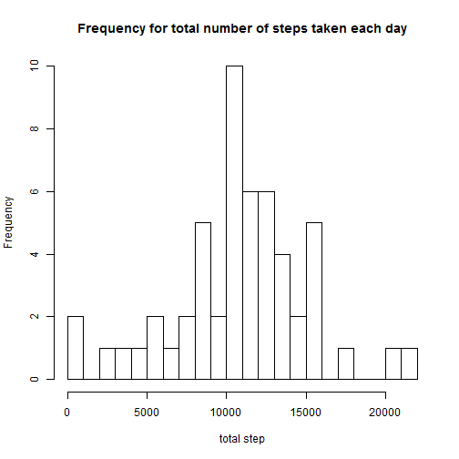
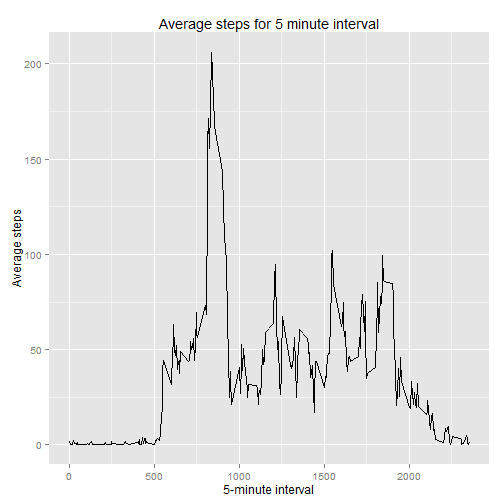
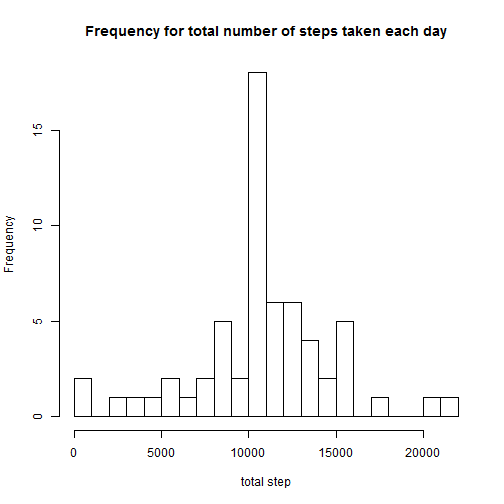

#Peer Assessment 1
==============================
Susan Lupiani

Loading and preprocessing the data


```r
setwd("C:/Users/Susan/Documents/R/repdata_data_activity")
steps <- read.csv("activity.csv", sep=",", na.strings = "NA")

options("scipen" = 10)
options()$scipen
```

```
## [1] 10
```
Remove rows with NAs


```r
steps <- steps[complete.cases(steps),]
```

What is the mean total number of steps taken per day?

1. Make a histogram of the total number of steps taken each day


```r
#Calculate total steps for each day
aggrstep <- aggregate(steps$steps, list(steps$date), sum)
names(aggrstep) <- c("date","totsteps")
#Create a histogram of the total number of steps taken each day
hist(aggrstep$totsteps, breaks = 20, main = "Frequency for total number of steps taken each day", xlab="total step")
```

 

2. Calculate and report the Mean and Median total number of steps taken per day


```r
#Calculate mean
mean <- as.numeric(mean(aggrstep$totsteps))
```
The mean number of steps is 10766.1886792.


```r
#calculate median
median <- median(aggrstep$totsteps)
```
The median number of steps is 10765.

Are there differences in activity patters between weekdays and weekends?
1. Make a time series plot of the 5-minute interval (x-axis) and the average number
of steps taken, averaged across all days (y-axis)


```r
#Compute average number of steps per time interval
avgs <- aggregate(steps$steps, list(steps$interval), mean)
names(avgs) <- c("interval","average")
maxavg <- paste("Interval with max avg steps =",subset(avgs$interval, avgs$average==max(avgs$average)))
#Create the plot
library("ggplot2")
g <- ggplot(avgs, aes(interval, average))
g + geom_line() + labs(x = "5-minute interval") + labs(y = "Average steps") + labs(title = "Average steps for 5 minute interval")
```

 

2. Which 5-minute interval, on average across all the days in the dataset, contains
the maximum number of steps?

```r
subset(avgs$interval, avgs$average==max(avgs$average))
```

```
## [1] 835
```


Calculate and report the total number of missing values in the dataset (i.e. the total number of rows with NAs)

```r
stepsAll <- read.csv("activity.csv", sep=",", na.strings = "NA")
steps <- stepsAll[complete.cases(stepsAll),]
missingValues <- nrow(stepsAll) - nrow(steps)
```
The number of missing values in the dataset is 2304.

Here is a strategy to fill in the missing values in the dataset.

```r
#Create a new data set and overwrite the NAs with the mean number of steps for that interval
stepsAll2 <- stepsAll
stepsInterMean <- aggregate(steps~interval, data = stepsAll2, FUN="mean")
subsKey <- match(stepsAll2[is.na(stepsAll2),"interval"],  stepsInterMean$interval)
stepsAll2[is.na(stepsAll2),"steps"] <- stepsInterMean[subsKey,"steps"]
```
Now we create a new histogram of the total number of steps taken each day. 

```r
aggrstep <- aggregate(stepsAll2$steps, list(stepsAll2$date), sum)
names(aggrstep) <- c("date","totsteps")
hist(aggrstep$totsteps, breaks = 20, main = "Frequency for total number of steps taken each day", xlab="total step")
```

 

Now we calculate the new mean and median total number of steps taken each day.


```r
#Calculate mean
meanAll <- as.numeric(mean(aggrstep$totsteps))
```
The mean number of steps is 10766.1886792.


```r
#calculate median
medianAll <- median(aggrstep$totsteps)
```
The median number of steps is 10766.1886792.

Results: There is no difference in the values of mean and median between the data set with NAs vs the data set we replaced the NAs with an average value. 

Are there differences in activity patterns between weekdays and weekends?


```r
stepsAll2$day <- weekdays(strptime(stepsAll2$date, format="%Y-%m-%d"))
a <- stepsAll2$day == "Sunday" | stepsAll2$day == "Saturday"
stepsAll2[a,4] <- "weekend"
stepsAll2[!a,4] <- "weekday"
```


```r
library(lattice)
xPlot <- aggregate(steps ~ interval + day, data=stepsAll2, FUN = "mean")
xyplot(xPlot$steps~xPlot$interval|xPlot$day,stepsAll2,layout=c(1,2),type="l",xlab="Interval",ylab="Number of Steps")
```

 

There is a difference in the activity pattern between weekdays and weekends. The activity is more evenly spread out over the course of the day during the weekend, but is spread in fewer bursts during the weekdays. 


